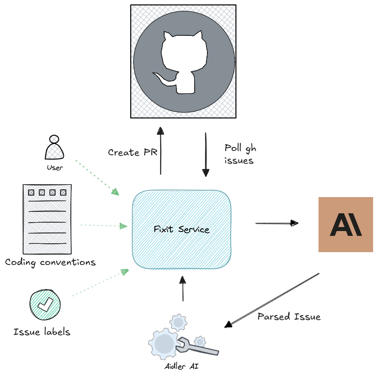

# fixit

A smart bot that listens to issues, gets tagged for action, automatically solves them, and opens a pull request with the fix.

## Video Tutorial

Here’s a video tutorial that walks you through the setup and usage:

<video controls>
  <source src="readme_res/fixit_walkthrough.mp4" type="video/mp4">
  Your browser does not support the video tag.
</video>

## Description

Fixit is an automated tool that helps maintain your codebase by:
- Monitoring repository issues
- Responding to specific tags or mentions
- Automatically analyzing and fixing common issues
- Creating pull requests with the proposed fixes



## Installation

1. Clone the repository:
```bash
git clone https://github.com/yourusername/fixit.git
cd fixit
```

2. Create a virtual environment (recommended):
```bash
python -m venv venv
source venv/bin/activate  # On Windows use: venv\Scripts\activate
```

3. Install dependencies:
```bash
pip install -r requirements.txt
```

## Usage

To use Fixit, simply add the `@fixit` mention to any issue you want the bot to address. Fixit will automatically analyze the issue, propose a solution, and open a pull request with the fix.

## Contributing

Contributions are welcome! Please feel free to submit a Pull Request.

## License

See the [LICENSE](LICENSE) file for details.
